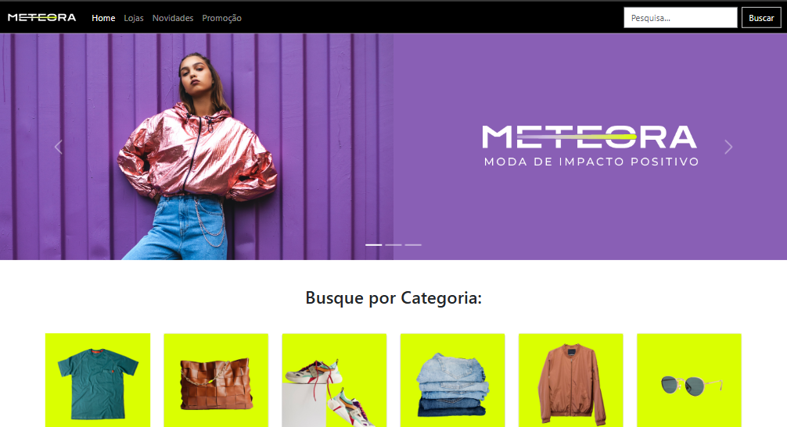

# Estudo BootStrap 5 

 

<a href="https://lpessolato.github.io/EstudoBootstrap/">ACESSE AQUI ⚠️</a>

# Objetivos 🎯

Estudo e pratica do bootstrap5

# Descrição e Tecnologias usadas 💻

Site desenhado pelo professores da Alura e desenvolvido e ajustado por mim. Foi usado HTML, CSS e BootStrap5 para desenvolver 

